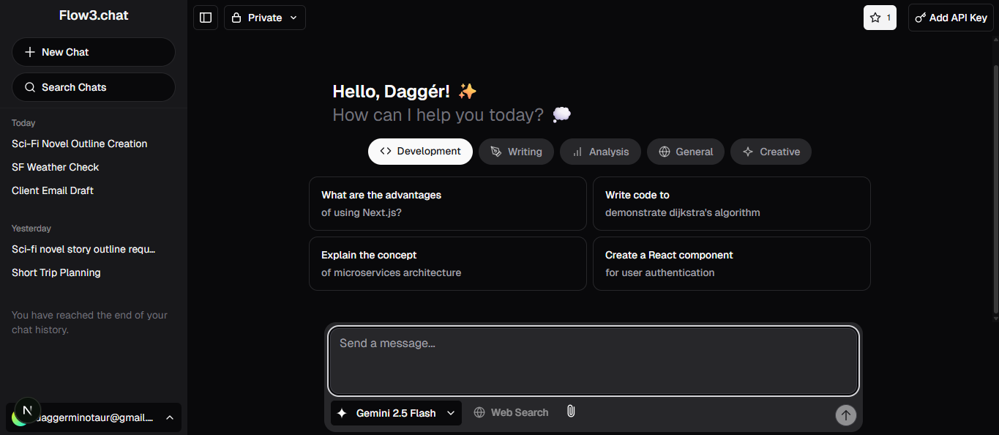
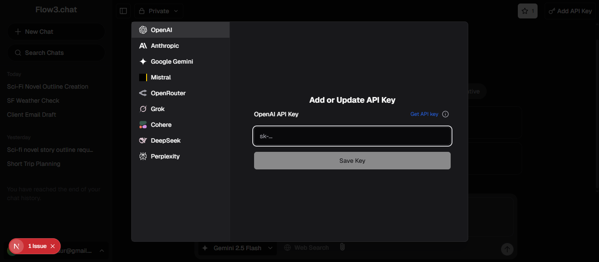
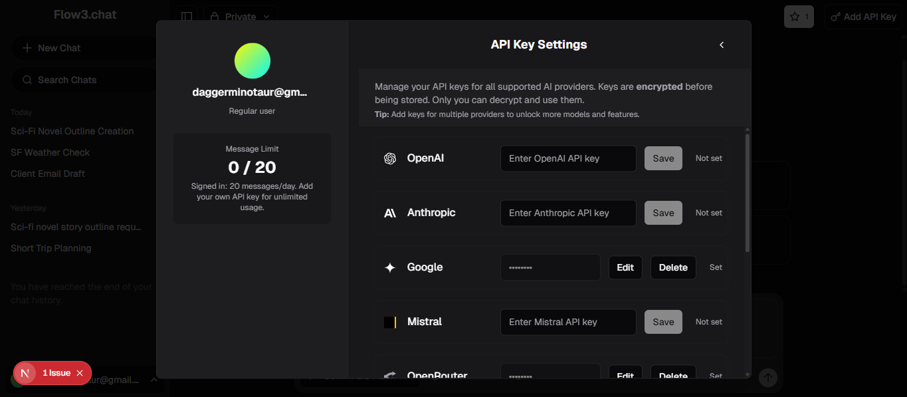

# Flow3.chat

[](LICENSE)

A free, open-source, multi-provider AI chat platform inspired by T3.chat. Built with Next.js, Vercel AI SDK, and a modern, privacy-first approach.

---

> **Built using the [Vercel AI Chatbot template](https://github.com/vercel/ai-chatbot) as a starting point.**

---

## Features

- **Multi-provider, multi-model support:**
  - OpenAI, Google Gemini, Anthropic, Mistral, Cohere, DeepSeek, Perplexity, xAI Grok, OpenRouter
- **BYOK (Bring Your Own Key):**
  - Users can add and manage their own API keys for any provider
- **Dynamic model selection:**
  - Global state sync (Zustand), instant switching, favorites/pinning
- **Web search integration:**
  - Powered by [Serper.dev](https://serper.dev)
- **Prompt engineering:**
  - Supports code in Python, JavaScript, TypeScript, Go, Rust, and more
- **Document/artifact mode:**
  - Code, text, and spreadsheet artifacts with real-time preview
- **Modern UI/UX:**
  - Scroll-to-bottom, provider avatars, pin/favorite models, keyboard shortcuts, and more
- **Privacy-first:**
  - No forced vendor lock-in, no required API keys, open source
- **Extensible:**
  - Easy to add new providers, models, or UI features

---

## Screenshots

### Chat Interface



### Add or Update API Key (BYOK Modal)



### Manage API Keys



---

## Tech Stack

- [Next.js](https://nextjs.org) (App Router)
- [Vercel AI SDK](https://sdk.vercel.ai/docs)
- [Zustand](https://zustand-demo.pmnd.rs/)
- [Serper.dev](https://serper.dev) (web search)
- [Tailwind CSS](https://tailwindcss.com)
- [shadcn/ui](https://ui.shadcn.com)
- [Radix UI](https://radix-ui.com)
- [IndexedDB](https://developer.mozilla.org/en-US/docs/Web/API/IndexedDB_API) (local favorites)
- [Redis](https://redis.io/) (optional, for resumable streams)

---

## Quickstart

1. **Clone the repo:**
   ```bash
   git clone https://github.com/yourusername/flow3.chat.git
   cd flow3.chat
   ```
2. **Install dependencies:**
   ```bash
   pnpm install
   # or
   npm install
   ```
3. **Configure environment variables:**
   - Copy `.env.example` to `.env.local` and fill in your keys (see below)
4. **Run locally:**
   ```bash
   pnpm dev
   # or
   npm run dev
   ```
5. **Open [localhost:3000](http://localhost:3000) in your browser.**

---

## Environment Variables

Copy `.env.example` to `.env.local` and fill in the following:

```
# Required for authentication
AUTH_SECRET=your-random-secret

# Optional: Enable Redis for resumable streams
REDIS_URL=redis://localhost:6379

# Optional: Enable Serper.dev for web search
SERPER_API_KEY=your-serper-api-key

# Optional: Set default API keys for providers (users can add their own in the UI)
OPENAI_API_KEY=sk-...
GEMINI_API_KEY=...
ANTHROPIC_API_KEY=...
MISTRAL_API_KEY=...
COHERE_API_KEY=...
DEEPSEEK_API_KEY=...
PERPLEXITY_API_KEY=...
XAI_GROK_API_KEY=...
OPENROUTER_API_KEY=...
```

---

## Contributing

Contributions are welcome! Please open issues or pull requests for bugs, features, or improvements.

---

## License

Apache 2.0. See [LICENSE](LICENSE) for details.

> Built using the [Vercel AI Chatbot template](https://github.com/vercel/ai-chatbot) as a starting point.

---

> Not affiliated with Vercel or T3. This is a community-driven, privacy-first AI chat platform.

[Connect with me on LinkedIn](https://www.linkedin.com/in/your-linkedin/) (replace with your link)
